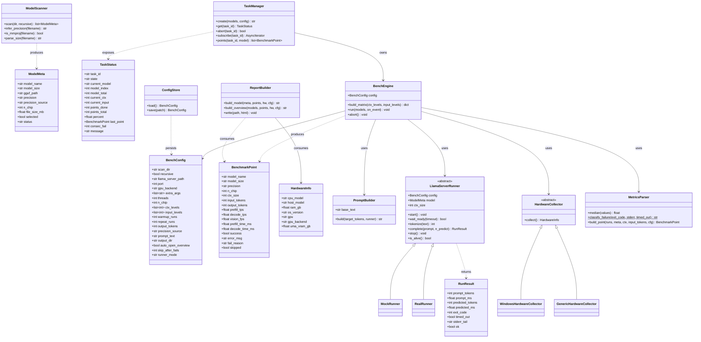
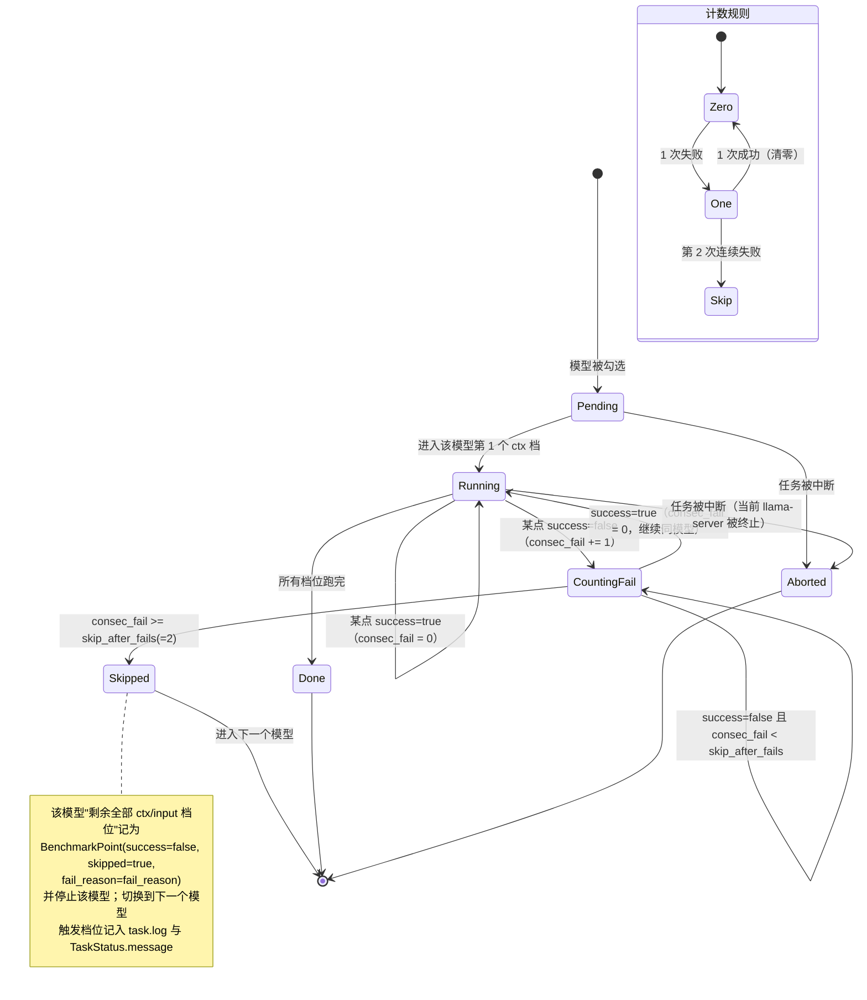

# ARCHITECTURE — 本地大模型批量性能测试工具（GGUF Benchmark）

> 版本：v1.0 ｜ 作者：高见远（架构师）｜ 状态：定稿（可交付工程师直接编码）
> 上游输入：`docs/PRD.md` v1.0 ｜ 黄金样本：`http://127.0.0.1/395-result.html`（本地路径 `395-result.html`）
> 语言：中文 ｜ 运行平台：Windows 11（目标机） / macOS（开发机，mock 全链路） ｜ 报告：零 CDN 单文件 HTML

---

## 0. 设计一页纸（TL;DR）

| 维度 | 决策 |
|---|---|
| 后端 | **FastAPI + Uvicorn**（后台线程池跑同步执行引擎），Python 3.11+ |
| 前端 | **零构建**：原生 HTML + 原生 JS（无框架、无打包、无 Node），由 FastAPI 静态挂载 |
| 报告 | 由 Python **字符串模板**生成单文件自包含 HTML，`<style>`/SVG/JS 结构与黄金样本 1:1 复用 |
| 可测性 | `LlamaServerRunner` / `HardwareCollector` 双抽象 + `MockRunner` / `GenericHardwareCollector`，配置切换；报告生成器纯函数、可离线单跑 |
| 执行 | 全局单任务串行；每 ctx 档重启 llama-server；连续 2 次失败跳过该模型剩余档位 |
| 依赖 | 仅 3 个第三方包：`fastapi`、`uvicorn[standard]`、`httpx` |

**开发机（macOS）可验证全链路**：`runner_mode=auto` 且 `llama_server_path` 不存在 → 自动降级 `MockRunner` → 端到端产出报告，与黄金样本逐字段对齐。目标机配置真实 `llama-server.exe` 即切换 `RealRunner`。

---

## Part A：系统设计

### 1. 实现方案总览与技术选型

#### 1.1 核心技术难点

| # | 难点 | 应对方案 |
|---|---|---|
| D1 | 开发机无 Windows / 无 llama.cpp / 无 目标机，真实指标不可得 | **运行器抽象**：`LlamaServerRunner` 接口 + `MockRunner`(确定性假数据) / `RealRunner`(子进程)；`runner_mode=auto` 自动探测降级 |
| D2 | Windows 硬件信息无法在 macOS 采集 | **采集器抽象**：`WindowsHardwareCollector`(PowerShell CIM) / `GenericHardwareCollector`(platform 降级/mock)，保证报告硬件区块始终有值 |
| D3 | 报告必须与黄金样本**逐字段**对齐且零 CDN 单文件 | ReportBuilder 复用黄金样本 `<style>`、SVG 生成公式、客户端 JS 结构；DATA 内联进 `<script>`；总览与单模型共用同一渲染函数 |
| D4 | 双维度矩阵正确裁剪 + 每档重启 + 连续失败跳过 | 显式 `build_matrix()` 裁剪函数 + 显式失败状态机（见 §7） |
| D5 | 任务须可中断且不残留进程/端口 | `TaskManager` 持有当前 runner 引用，abort() → runner.stop() → 杀进程树 + 释放端口；引擎在每点检查 `abort_event` |
| D6 | 前端实时进度且离线 | SSE (A10) 为主、轮询 (A9) 为回退；前端纯 JS `EventSource`，不可用即切 `setInterval` |

#### 1.2 技术选型与理由

| 层 | 选型 | 理由 |
|---|---|---|
| 后端框架 | **FastAPI** | PRD 指定；自带 Pydantic 校验 + OpenAPI；路由声明式，A1~A15 映射清晰 |
| ASGI 服务器 | **Uvicorn[standard]** | FastAPI 标配；支持 SSE 长连接；可 `--host 127.0.0.1` 本地绑定 |
| HTTP 客户端 | **httpx** | 调用 llama-server 的 `/health` `/tokenize` `/completion`；超时/流式控制好 |
| 并发模型 | FastAPI 事件循环 + `asyncio.to_thread` 跑**同步**引擎 | 引擎是阻塞式子进程编排，放线程池；事件循环只负责 HTTP/SSE，简单可靠 |
| 数据模型 | **Pydantic v2**（随 FastAPI） | 直接给 JSON Schema、字段校验、`model_dump()` 序列化 |
| **前端形态** | **零构建原生 HTML/JS（无框架）** | 见下 |
| 报告模板 | **Python 字符串模板（f-string + 少量辅助函数），不用 Jinja2** | 报告是"单文件自包含 HTML"，需要内联大块 CSS/JS；Jinja2 的自动转义反而增加心智负担。仅在需转义处用 `html.escape()`。少一个依赖 |
| 端口检测 | **标准库 `socket`** | `socket.bind()` 试探 8765/8080，无需 psutil |
| 进程管理 | **标准库 `subprocess`** | `Popen` 启 llama-server；Windows 用 `CREATE_NEW_PROCESS_GROUP` + `taskkill /T` 杀进程树 |

#### 1.3 关键决策：前端 = 零构建原生实现（拍板理由）

**决策：前端不引入 React，不使用 Vite/打包器，纯原生 HTML + 原生 JS。**

| 理由 | 说明 |
|---|---|
| R1 一致的技术底座 | 报告本身就是原生 JS（黄金样本如此）。UI 与报告共用同一套渲染与交互约定，工程师只需掌握一套心智模型 |
| R2 目标机零 Node 依赖 | Windows 目标机只装 Python。若用 Vite，交付物需预构建产物或要求目标机装 Node，违背"零门槛"（G1） |
| R3 交互复杂度可控 | 6 个页面本质是**单页多视图切换** + 表格 + 进度条 + SSE，原生 DOM 足够；无复杂状态树，引入框架是过度设计 |
| R4 离线硬约束 | 原生实现天然零 CDN、零外网；无需处理构建产物的资源内联问题 |
| R5 体积/启动 | 单 `index.html` + 2 个 js + 1 个 css，`file` 直开或 FastAPI 挂载均可，启动 < 50ms |

> 前端"6 个页面"实现为 `index.html` 内 6 个 `<section class="view">`，由 `app.js` 的极简哈希路由 `location.hash`（`#status/#scan/#select/#config/#progress/#report`）控制显隐。

#### 1.4 架构分层

```
┌────────────────────────────────────────────────────────────┐
│  浏览器（零构建原生 UI）  web/index.html + app.js + api.js   │
│   状态页 / 扫描 / 勾选 / 配置 / 进度 / 报告(iframe)           │
└───────────────▲───────────────────────────┬────────────────┘
        JSON(A1-A15) / SSE(A10)              │ iframe/file 访问
┌───────────────┴───────────────────────────▼────────────────┐
│  FastAPI  app.py ─ api.py(路由) ─ StaticFiles(web/, reports/)│
│      │                                                       │
│      ├── TaskManager（任务状态 + SSE 广播 + 中断）            │
│      │        │                                              │
│      │        ▼                                              │
│      │   BenchEngine（同步，跑在 asyncio.to_thread）          │
│      │        ├─ LlamaServerRunner(ABC) ─ Mock/Real          │
│      │        ├─ MetricsParser（中位数/失败归因）             │
│      │        ├─ PromptBuilder（/tokenize 校准）              │
│      │        └─ HardwareCollector(ABC) ─ Windows/Generic    │
│      │                                                       │
│      └── ReportBuilder ─ chart.py(SVG) + template.py(HTML)   │
│   ConfigStore(config.json)  ModelScanner(扫描 gguf)           │
└──────────────────────────────────────────────────────────────┘
       │ spawn                                   │ 读取
       ▼                                         ▼
  llama-server.exe (真实)                  reports/<model>/*.html
  /health /tokenize /completion            reports/overview.html
```

---

### 2. 目录结构与完整文件清单

> 相对根目录 `<PROJECT>/`。共 **30 个文件**（含 2 个文档产物）。

| # | 相对路径 | 职责（一句话） |
|---|---|---|
| 1 | `start.bat` | Windows 一键启动：校验 Python≥3.11 → 后台 `pythonw run.py`（不占前台窗口）→ 打开浏览器 |
| 2 | `run.py` | 程序入口：解析参数、构建 FastAPI app、启动 Uvicorn、可选自动开浏览器；亦支持 `--report-only` 离线重建报告 |
| 3 | `requirements.txt` | 第三方依赖清单（3 条） |
| 4 | `README.md` | 使用说明 + 目标机冒烟步骤（可选，P2） |
| 5 | `config/default_config.json` | 默认配置（BenchConfig 初值，10 默认值+8 决策） |
| 6 | `ggufbench/__init__.py` | 包版本号与常量（`__version__ = "1.0"`，`TOOL_NAME`） |
| 7 | `ggufbench/errors.py` | 错误码枚举 `ErrorCode` + `ApiError` 异常 + 统一错误响应构造 |
| 8 | `ggufbench/logging_utils.py` | 日志初始化（统一格式）+ 每模型日志目录工具 |
| 9 | `ggufbench/app.py` | FastAPI 应用装配：CORS(本地)、路由注册、`/web` 与 `/reports` 静态挂载 |
| 10 | `ggufbench/api.py` | A1~A15 全部路由实现（薄层，委派给各服务） |
| 11 | `ggufbench/models.py` | 全部 Pydantic 数据模型（BenchmarkPoint/ModelMeta/HardwareInfo/TaskStatus/BenchConfig/RunResult 等） |
| 12 | `ggufbench/config_store.py` | `ConfigStore`：读写 `config.json`，default_config 合并，PUT 增量 patch |
| 13 | `ggufbench/scanner.py` | `ModelScanner`：递归扫描 `*.gguf`、忽略 mmproj、推断尺寸与精度 |
| 14 | `ggufbench/hardware.py` | `HardwareCollector` 抽象 + `WindowsHardwareCollector`(CIM) + `GenericHardwareCollector`(降级) + `get_collector()` 工厂 |
| 15 | `ggufbench/prompt_builder.py` | `PromptBuilder`：内置中性长文本、按目标 token 填充/截断、`/tokenize` 校准 |
| 16 | `ggufbench/metrics.py` | `MetricsParser`：中位数、tps/耗时换算、fail_reason 判定 `classify_failure()` |
| 17 | `ggufbench/engine.py` | `BenchEngine`：双维度矩阵裁剪、串行编排、每档重启、失败状态机、事件回调 |
| 18 | `ggufbench/task_manager.py` | `TaskManager`：任务生命周期、TaskStatus 快照、abort、SSE 订阅广播 |
| 19 | `ggufbench/runners/__init__.py` | 运行器工厂 `make_runner(config, model, ctx)` 与包导出 |
| 20 | `ggufbench/runners/base.py` | `LlamaServerRunner` ABC：start/wait_ready/tokenize/complete/stop/is_alive + 就绪探测/超时/重启封装 |
| 21 | `ggufbench/runners/mock_runner.py` | `MockRunner`：确定性合成 timings（按模型尺寸+输入长度的经验模型），供开发机全链路 |
| 22 | `ggufbench/runners/real_runner.py` | `RealRunner`：真实子进程启停 + httpx 调 `/health` `/tokenize` `/completion` + stderr 捕获 |
| 23 | `ggufbench/report/__init__.py` | 报告包导出 |
| 24 | `ggufbench/report/chart.py` | `render_chart_svg(points, metric)`：对数横轴 + 线性纵轴的 SVG 生成（坐标映射算法见 §8） |
| 25 | `ggufbench/report/template.py` | 黄金样本 `<style>` 常量、客户端 JS 常量（含**新增排序**）、页面骨架 `render_report_html()` |
| 26 | `ggufbench/report/builder.py` | `ReportBuilder`：组装单模型 / 总览报告并落盘；`build_from_points_json()` 离线入口 |
| 27 | `web/index.html` | 零构建单页：6 个 `<section class="view">` 骨架 |
| 28 | `web/app.js` | 哈希路由 + 6 视图交互 + SSE/轮询进度 + 中断 |
| 29 | `web/api.js` | 后端 A1~A15 的 fetch 封装 + 统一错误处理 |
| 30 | `web/styles.css` | UI 样式（复用报告 CSS 变量，深色主题） |

产出物（运行时生成，不入库）：`config.json`、`reports/overview.html`、`reports/<model>_<precision>.html`、`reports/<model>/llama_stdout.log`、`llama_stderr.log`、`points.json`、`task.log`。

---

### 3. 模块划分与接口定义

#### 3.1 类图（Mermaid classDiagram）



#### 3.2 关键接口签名（供工程师直接落地）

```python
# ---------- runners/base.py ----------
class LlamaServerRunner(ABC):
    def __init__(self, config: BenchConfig, model: ModelMeta, ctx_size: int, log_dir: Path): ...
    @abstractmethod
    def start(self) -> None: ...                      # 启动子进程（mock 记录参数即可）
    @abstractmethod
    def wait_ready(self, timeout_s: float = 120.0) -> bool: ...  # 轮询 /health
    @abstractmethod
    def tokenize(self, text: str) -> int: ...         # POST /tokenize
    @abstractmethod
    def complete(self, prompt: str, n_predict: int) -> RunResult: ...
    @abstractmethod
    def stop(self) -> None: ...                       # 终止 + 释放端口
    @abstractmethod
    def is_alive(self) -> bool: ...
    def restart_once(self) -> bool: ...               # 崩溃后重启一次（模板方法，基于 start+wait_ready）

# ---------- runners/real_runner.py ----------
class RealRunner(LlamaServerRunner):
    # build_cmd() -> list[str]  完整启动参数（记录进报告）
    def build_cmd(self) -> list[str]: ...
    # start(): subprocess.Popen(cmd, stdout=log_f, stderr=log_f2,
    #          creationflags=CREATE_NEW_PROCESS_GROUP on Windows)
    # stop(): terminate -> wait(5s) -> kill process tree (taskkill /T /F)

# ---------- hardware.py ----------
class HardwareCollector(ABC):
    @abstractmethod
    def collect(self) -> HardwareInfo: ...

class WindowsHardwareCollector(HardwareCollector):
    # 用 powershell Get-CimInstance 采集:
    #   Win32_Processor.Name -> cpu_model
    #   Win32_ComputerSystem.Model / Win32_BaseBoard -> host_model
    #   Win32_ComputerSystem.TotalPhysicalMemory -> ram_gb
    #   Win32_OperatingSystem.Caption+Version+BuildNumber -> os_version
    #   Win32_VideoController.Name -> gpu ; AdapterRAM -> uma_vram_gb(近似)
class GenericHardwareCollector(HardwareCollector):
    # platform.processor()/platform.machine()/os.cpu_count() -> 降级字段，
    # macOS/Linux 上返回可读 mock，保证报告硬件区块非空

def get_collector(platform_name: str | None = None) -> HardwareCollector: ...

# ---------- engine.py ----------
class BenchEngine:
    def __init__(self, config, *, runner_factory=make_runner,
                 hardware=None, prompt_builder=None, on_event: Callable | None = None): ...
    def build_matrix(self, ctx_levels: list[int], input_levels: list[int]) -> dict:
        """返回 {"pairs": [(ctx,input),...], "per_ctx": {ctx: [inputs]}, "total": int}
           规则：仅保留 input < ctx（决策2）。"""
    def run(self, models: list[ModelMeta]) -> None: ...
    def abort(self) -> None: ...   # 置 abort_event，通知当前 runner.stop()

# ---------- task_manager.py ----------
class TaskManager:
    def create(self, task_id: str, models: list[ModelMeta], config: BenchConfig) -> str: ...
    def get(self, task_id: str) -> TaskStatus: ...
    def abort(self, task_id: str) -> bool: ...
    async def subscribe(self, task_id: str) -> AsyncIterator[str]: ...  # SSE
    def points(self, task_id: str, model: str | None = None) -> list[BenchmarkPoint]: ...
    def is_busy(self) -> bool: ...   # 全局单任务（决策：串行）

# ---------- report/builder.py ----------
class ReportBuilder:
    def __init__(self, tool_version: str, llama_version: str = "unknown"): ...
    def build_model(self, meta: ModelMeta, points: list[BenchmarkPoint],
                    hw: HardwareInfo, cfg: BenchConfig, launch_cmds: dict[int, list[str]]) -> str: ...
    def build_overview(self, models: list[ModelMeta], points: list[BenchmarkPoint],
                       hw: HardwareInfo, cfg: BenchConfig) -> str: ...
    def write(self, path: Path, html: str) -> None: ...
    @staticmethod
    def build_from_points_json(points_json: Path, out_html: Path, *, overview: bool = False) -> None: ...
```

---

### 4. 数据结构定义（Python）

`ggufbench/models.py` 全部使用 Pydantic v2 BaseModel（与 PRD §6 逐字段一致）。

```python
from typing import Literal, Optional
from pydantic import BaseModel, Field

FailReason = Literal["OOM_GPU", "MODEL_FAIL", "TIMEOUT", "OTHER", ""]
Precision = Literal["w8a8", "w4a8"]

class BenchmarkPoint(BaseModel):          # 14 字段（与黄金样本逐字段对齐）+ x-extension
    model_name: str
    model_size: str
    precision: Precision
    n_chip: int = 1
    ctx_size: int
    input_tokens: int
    output_tokens: int = 256
    prefill_tps: float = 0.0
    decode_tps: float = 0.0
    vision_fps: float = 0.0
    prefill_time_ms: float = 0.0
    decode_time_ms: float = 0.0
    success: bool = True
    error_msg: str = ""
    # --- x-extension ---
    fail_reason: FailReason = ""
    skipped: bool = False

class ModelMeta(BaseModel):
    model_name: str
    model_size: str
    gguf_path: str
    precision: Precision = "w8a8"
    precision_source: Literal["filename", "manual"] = "filename"
    n_chip: int = 1
    file_size_mb: float = 0.0
    selected: bool = False
    status: Literal["pending", "running", "done", "skipped", "aborted"] = "pending"

class HardwareInfo(BaseModel):
    cpu_model: str = "Unknown CPU"
    host_model: str = "Unknown Host"
    ram_gb: float = 0.0
    os_version: str = ""
    gpu: str = ""
    gpu_backend: str = ""
    uma_vram_gb: float = 0.0

class TaskStatus(BaseModel):
    task_id: str
    state: Literal["idle", "running", "aborting", "done", "error"] = "idle"
    current_model: str = ""
    model_index: int = 0
    model_total: int = 0
    current_ctx: int = 0
    current_input: int = 0
    points_done: int = 0
    points_total: int = 0
    percent: float = 0.0
    last_point: Optional[BenchmarkPoint] = None
    consec_fail: int = 0
    message: str = ""

class BenchConfig(BaseModel):
    scan_dir: str = ""
    recursive: bool = True
    llama_server_path: str = ""
    port: int = 8080
    gpu_backend: str = "vulkan"
    extra_args: list[str] = Field(default_factory=list)
    threads: int = 16
    n_chip: int = 1
    ctx_levels: list[int] = [4000, 8000, 16000, 32000, 64000, 128000, 256000]
    input_levels: list[int] = [250, 500, 1000, 2000, 4000, 8000, 16000, 32000, 64000, 128000]
    warmup_runs: int = 1
    repeat_runs: int = 3
    output_tokens: int = 256
    precision_source: Literal["filename", "manual"] = "filename"
    prompt_text: str = ""
    output_dir: str = "./reports"
    auto_open_overview: bool = True
    skip_after_fails: int = 2
    runner_mode: Literal["auto", "real", "mock"] = "auto"   # 开发机可强制 mock
    prefill_timeout_s: int = 1800                            # 单点上限 30min（Q4）
    scan_result: list[ModelMeta] = Field(default_factory=list)  # 扫描缓存（UI 用）
```

> `RunResult`（内部，非 API 契约，用 `@dataclass`）：
> ```python
> @dataclass
> class RunResult:
>     prompt_tokens: int = 0
>     prompt_ms: float = 0.0
>     predicted_tokens: int = 0
>     predicted_ms: float = 0.0
>     exit_code: int = 0
>     timed_out: bool = False
>     stderr_tail: str = ""
>     ok: bool = True
> ```

---

### 5. 程序调用流程时序图（Mermaid）

> 主流程：启动 → 扫描 → 勾选 → 预览矩阵 → 执行（含每档重启）→ 采集 → 生成报告 → 自动打开。
> 同图存于 `docs/sequence-diagram.mermaid`。

```mermaid
sequenceDiagram
    autonumber
    actor U as 用户
    participant B as 浏览器(web/app.js)
    participant API as FastAPI(api.py)
    participant TM as TaskManager
    participant EN as BenchEngine
    participant RN as LlamaServerRunner
    participant MP as MetricsParser
    participant RB as ReportBuilder

    Note over U,B: 启动：start.bat → pythonw run.py → Uvicorn(127.0.0.1:8765) → 自动开浏览器
    B->>API: GET /api/health (A1)
    API-->>B: {ok, python_version, llama_server_found}

    U->>B: 输入目录，点「扫描」
    B->>API: POST /api/scan {dir, recursive} (A4)
    API->>API: ModelScanner.scan() 忽略 mmproj、推断精度
    API-->>B: {models:[ModelMeta...]}

    U->>B: 勾选模型 + 填配置
    B->>API: PUT /api/config {patch} (A3)
    API->>API: ConfigStore.save()
    B->>API: POST /api/tasks/preview {models, config} (A7)
    API->>EN: build_matrix(ctx_levels, input_levels) 仅 input<ctx
    EN-->>API: {total_points, per_model, matrix}
    API-->>B: 预计点数（前端显示）

    U->>B: 点「开始测试」
    B->>API: POST /api/port-check {port} (A5)
    API-->>B: {in_use:false}
    B->>API: POST /api/tasks {models, config} (A8)
    API->>TM: create(task_id, models, config)
    TM->>EN: asyncio.to_thread(engine.run)  后台串行
    API-->>B: {ok, task_id}

    B->>API: GET /api/tasks/{id}/events (A10, SSE)
    loop 每模型
        Note over EN: 记录启动参数(决策10)
        loop 每个 ctx 档
            EN->>RN: start(ctx) ; wait_ready()
            RN-->>EN: ready / crash
            loop 每个 input (input<ctx)
                EN->>RN: tokenize(prompt) 校准真实 token
                EN->>RN: complete() 预热×1
                EN->>RN: complete() 正式×N
                RN-->>EN: RunResult
                EN->>MP: build_point(runs,...) 取中位数
                MP-->>EN: BenchmarkPoint(success, fail_reason)
                EN->>TM: 更新 TaskStatus + 广播 SSE
                TM-->>B: data: {percent, current_ctx, last_point}
                alt 连续失败 >=2
                    EN->>EN: 标 skipped，break 全部档位
                end
            end
            EN->>RN: stop()  释放端口
        end
        EN->>RB: build_model(meta, points, hw, cfg, launch_cmds)
        RB-->>EN: 写 reports/<model>_<prec>.html + logs + points.json
    end
    EN->>RB: build_overview(all models, all points, hw, cfg)
    RB-->>EN: 写 reports/overview.html
    EN->>TM: state=done, 广播完成
    TM-->>B: SSE done
    B->>API: GET /api/reports (A13)
    API-->>B: reports 列表
    Note over B: auto_open_overview=true → iframe 打开 overview.html（A15）
    U->>B: 报告内筛选/排序（纯客户端 JS）
```

**中断分支**：任意时刻 `U→B→POST /api/tasks/{id}/abort (A11) → TM.abort() → EN.abort() → 当前 RN.stop() → 进程树终止 → state=aborting/done`。

---

### 6. 失败跳过状态机（Mermaid stateDiagram）

> **计数与重置规则（PRD Q1 + 决策8）**：`consec_fail` **跨 ctx 档位不重置**；同一模型内**任何一次成功 → 立即清零**；达到 `skip_after_fails`(=2) → 该模型剩余全部档位标 `skipped=true`。
> 同图存于 `docs/class-diagram.mermaid` 之外另存 `docs/sequence-diagram.mermaid`；状态图内嵌如下。



**明确规则表**

| 事件 | consec_fail 变化 | 后续行为 |
|---|---|---|
| 成功点 | `= 0`（无论之前几次失败） | 继续下一 input |
| 失败点（< 阈值） | `+= 1` | 继续下一 input |
| 失败点（达阈值） | 保持 | 标 skipped、break 本模型全部档位 |
| 跨 ctx 档位重启 | **不变**（不重置） | 新档位首个点成功即清零 |
| 任务中断 | 冻结 | 模型状态 aborted |

---

### 7. 关键算法伪码

#### ① 双维度矩阵裁剪 `BenchEngine.build_matrix`
```
function build_matrix(ctx_levels, input_levels):
    pairs = []
    per_ctx = {}
    for ctx in sorted(ctx_levels):
        valid_inputs = [i for i in sorted(input_levels) if i < ctx]   # 决策2：仅 input<ctx
        if valid_inputs is empty: continue
        per_ctx[ctx] = valid_inputs
        for i in valid_inputs: pairs.append((ctx, i))
    return { pairs: pairs, per_ctx: per_ctx, total: len(pairs) }

# 默认档位下 total = Σ_ctx |{i: i<ctx}| 
#  ctx:  4K→4, 8K→5, 16K→6, 32K→7, 64K→8, 128K→9, 256K→10  => 49 组/模型
```
> 注：PRD UI 文案示例写"45 组"，按 `input<ctx` 精确计算实为 **49 组/模型**（input 档 250~128000，ctx 档 4000~256000；逐档 4+5+6+7+8+9+10=49）。前端"预计组合数"以后端 A7 返回值为准，避免硬编码不符。

#### ② 指标采集与中位数（含 warmup）`BenchEngine.measure_point` + `MetricsParser`
```
function measure_point(runner, model, ctx, input_tokens, cfg):
    prompt = prompt_builder.build(input_tokens, runner)   # /tokenize 循环校准到真实 token≈input
    # warmup
    for _ in range(cfg.warmup_runs):
        runner.complete(prompt, cfg.output_tokens)        # 结果丢弃（仅暖机）

    runs = []
    attempts = 0
    while len(runs) < cfg.repeat_runs and attempts < cfg.repeat_runs + 2:
        r = runner.complete(prompt, cfg.output_tokens)
        if not r.ok:
            # 崩溃后重启一次再计失败（算法④）
            if not r.timed_out and runner.restart_once():
                r = runner.complete(prompt, cfg.output_tokens)
            if not r.ok:
                return failed_point(r)     # 直接判失败，交由状态机计数
        runs.append(r); attempts += 1

    # 取中位数
    prefill_tps_list = [r.prompt_tokens / (r.prompt_ms/1000) for r in runs]
    decode_tps_list  = [r.predicted_tokens / (r.predicted_ms/1000) for r in runs]
    return BenchmarkPoint(
        prefill_tps = median(prefill_tps_list),
        decode_tps  = median(decode_tps_list),
        prefill_time_ms = median([r.prompt_ms for r in runs]),
        decode_time_ms  = median([r.predicted_ms for r in runs]),
        input_tokens = round(median([r.prompt_tokens for r in runs])),  # 真实 token（非估算）
        success=True)
```
`median(values)`：排序后取中位（偶数取中间两数平均）；空列表返回 0。

#### ③ llama-server 就绪探测与超时 `LlamaServerRunner.wait_ready`
```
function wait_ready(timeout_s=120):
    t0 = now()
    while now()-t0 < timeout_s:
        if not is_alive():        # 进程已退出
            return false          # 崩溃 → 交由上层 restart_once
        try:
            resp = GET http://127.0.0.1:{port}/health (timeout=2s)
            if resp.status == 200 and resp.json().get("status") in ("ok","no slot available"):
                return true
        except ConnectionError: pass
        sleep(0.5)
    return false                  # 超时

# 单点测量超时（P0#8 资源约束 / Q4）
timeout_s = cfg.prefill_timeout_s   # 默认 1800s；可覆盖为 ctx ÷ 最低速率 × 3
```

#### ④ 崩溃后重启一次再计失败 `restart_once`
```
function restart_once():
    if already_restarted: return false        # 每档只允许重启一次
    already_restarted = true
    stop()                                    # 确保旧进程清理
    start(); return wait_ready()
# 规则：崩溃 → 重启一次 → 若仍失败 → 该点判失败（计入 consec_fail）
#       重启成功 → 重新测量该点，不额外计失败
```

#### ⑤ 端口占用检测 `socket`（A5）
```
function is_port_in_use(host, port):
    s = socket.socket(AF_INET, SOCK_STREAM)
    s.setsockopt(SOL_SOCKET, SO_REUSEADDR, 0)
    try:
        s.bind((host, port))   # 能 bind → 未占用
        return false
    except OSError:
        return true            # 被占用
    finally:
        s.close()
# 后端自身端口(8765) 与 llama-server 端口(8080) 均用此检测
```

#### ⑥ fail_reason 判定 `MetricsParser.classify_failure`
```
function classify_failure(exit_code, stderr, timed_out):
    if timed_out: return "TIMEOUT"
    s = stderr.lower()
    OOM = ["out of memory","oom","failed to allocate","cuda error: out of memory",
           "vk_error_out_of_device_memory","hip out of memory","unable to allocate",
           "ggml_vulkan","insufficient memory","vk_error"]
    if any(k in s for k in OOM): return "OOM_GPU"
    MODEL = ["failed to load model","unknown model architecture","invalid model",
             "gguf","failed to open","magic","tensor","corrupt","not supported"]
    if any(k in s for k in MODEL): return "MODEL_FAIL"
    if exit_code not in (0, None): return "OTHER"
    return "OTHER"
```
**可读中文映射**（渲染用）：`OOM_GPU→显存不足(OOM)`、`MODEL_FAIL→模型加载失败`、`TIMEOUT→超时`、`OTHER→运行失败`。OOM 类触发报告顶部提示横幅：「检测到 OOM，请检查 BIOS 中 UMA 显存划分是否充足」（US-07）。

---

### 8. 报告生成器设计

#### 8.1 复用黄金样本的方式

| 黄金样本元素 | 复用策略 |
|---|---|
| `<style>`（`:root` CSS 变量、`.header/.controls/.summary/.chart-container/.model-section/.intro/.badge` 等） | 原样拷贝为 `template.py` 的 `CSS: str` 常量；UI（`web/styles.css`）也复用同一组变量 |
| `:root` 变量（`--bg:#1a1a2e; --accent:#00d4aa; --accent2:#7c83ff; --red:#ff6b6b; --header-bg:#0f3460`） | 作为全局色彩真源，UI 与报告一致 |
| 页头 `.header`（标题 + 生成时间 + 工具版本 + llama.cpp 版本） | 模板插值 |
| `<details class="intro">` 参数说明区 | 原样复用其 10 条 `.intro-item`，**新增** caption 与 OOM 提示横幅 |
| `.controls` 4 个 `<select>`（模型/精度/芯片/ctx） | 原样复用；`initFilters()` 动态填充 |
| `.summary` 摘要卡（总数据点/成功率/最高 Prefill/最高 Decode） | 复用 `renderSummary()` |
| 两个 `.chart-container` + `<svg viewBox="0 0 1180 380">`（Prefill/Decode） | 复用结构，由 `chart.py` **服务端预生成** 全量 SVG（零 CDN，客户端仅切换可见性） |
| `#tables` + `renderTables()` | 复用，**新增** 精度/芯片数列 + **表头点击排序** |
| `<script>const DATA=[...]; const MODELS=[...]</script>` | 注入序列化后的 points 数组与模型名数组 |
| `initFilters/getFilteredData/renderSummary/updateChartVisibility/renderAll` | 逐字复用 |
| `.footer`（硬件 + 方法论说明） | 复用并追加硬件区块 |

#### 8.2 单文件组装顺序（`builder.py`）

```
render_report_html(kind, models, points, hw, cfg, launch_cmds, llama_version) -> str:
  parts = []
  parts.append("<!DOCTYPE html><html lang=zh-CN><head>…<style>" + CSS + "</style></head><body>")
  parts.append(header_html(title, generated_at, TOOL_NAME+version, llama_version))
  parts.append(intro_html(cfg))                    # <details class="intro" open> + OOM 横幅(如有)
  parts.append(controls_html())                    # 4 selects + 数据点计数
  parts.append('<div class="summary" id="summaryCards"></div>')
  parts.append(chart_container(render_chart_svg(points, "prefill")))   # 曲线1
  parts.append(chart_container(render_chart_svg(points, "decode")))    # 曲线2
  parts.append('<div id="tables"></div>')
  parts.append(hardware_html(hw, launch_cmds))     # 硬件信息 + 每档启动参数
  parts.append(footer_html())
  parts.append("<script>const DATA=" + json.dumps(points_json, ensure_ascii=False)
               + "; const MODELS=" + json.dumps(model_names, ensure_ascii=False)
               + ";\n" + CLIENT_JS + "\n</script></body></html>")
  return "".join(parts)
```

* `kind="overview"`：`points` = 全部模型点；`kind="model"`：`points` = 单模型点。
* 浏览器零构建、报告零 CDN、单文件自包含（内联 CSS/JS/SVG，无任何外链）。
* `<meta charset="UTF-8">`，`json.dumps(..., ensure_ascii=False)` 保证中文/`</script>` 安全（转义 `<`→`\u003c`）。

#### 8.3 客户端 JS 增强（`template.py` 的 `CLIENT_JS`）

在黄金样本函数基础上做 3 处改动：

1. **`renderTables` 增加两列**：表头变为
   `Ctx(k) | Input(k) | Prefill(tps) | Decode(tps) | P-Time(ms) | D-Time(ms) | Vision(fps) | 精度 | 芯片数 | 状态`
   （与 PRD §5.8 列序一致，精度/芯片数为一等列）。
2. **表头可点击排序**：为每个 `<th>` 附 `data-key` 与 `data-type`，点击切换 升/降序，重排后重渲染该表：
   ```
   thead th[data-key] click:
     if sortKey==key: sortDir*=-1 else {sortKey=key; sortDir=1}
     renderTables(getFilteredData())     # 全局 sortKey/sortDir
   ```
   排序映射：`ctx→ctx_size, input→input_tokens, prefill→prefill_tps, decode→decode_tps,
   ptime→prefill_time_ms, dtime→decode_time_ms, vision→vision_fps, precision→precision(字典序),
   chip→n_chip, status→success/skipped`。失败/跳过点恒排在末尾。
3. **状态徽章**：成功 `OK`；`skipped` → `已跳过`；失败 → `fail_reason` 的中文可读名（US-07）。

#### 8.4 曲线图 SVG 坐标映射算法（`chart.py`）

黄金样本参数（复刻，不可改）：`viewBox="0 0 1180 380"`；绘图区 `x∈[70,1150]`、`y∈[40,320]`；背景矩形 `#16213e` + 绘图底 `#0f1729`。

```
function render_chart_svg(points, metric):        # metric ∈ {"prefill","decode"}
  X0, X1, Y0, Y1 = 70, 1150, 40, 320              # 左上 X0,Y0 ; 右下 X1,Y1
  # 横轴：对数，定义域固定 [250, 256000]
  xmin, xmax = 250, 256000
  def xmap(v):
      return X0 + (log10(v) - log10(xmin)) / (log10(xmax) - log10(xmin)) * (X1 - X0)
  #  校验: 250→70, 1000→286, 4000→502, 16000→718, 64000→934, 256000→1150

  # 纵轴：线性，ymax 取"向上取整到 nice 数"，5 条网格线
  vals = [p[metric+"_tps"] for p in points if p.success]
  ymax = nice_ceil(max(vals or [1]))              # nice_ceil: 1/2/5×10^k 向上取整
  def ymap(v):
      return Y1 - (v / ymax) * (Y1 - Y0)
  #  校验 golden: ymax≈9376（max≈8500），0→320, 1/5→264, 2/5→208 …

  svg  = 背景矩形 + 5 条水平网格线(值=ymax*k/5,k=0..5, 标签 toLocaleString) 
       + 6 条垂直网格线(在 0.25k,1k,4k,16k,64k,256k 处，标签如上)
       + 坐标轴线(描边 #4a4a6a) + 标题文字(metric 中文) + 横轴标题"输入 Token 数 (k, 对数轴)"
  # 按 (model,ctx) 分组 → 每条 series
  palette = ["#00d4aa","#7c83ff","#ff6b6b","#ffd93d","#6bcb77","#4d96ff",
             "#ff922b","#e599f7","#20c997","#f06595","#748ffc","#ffa94d"]  # 循环取色
  for idx, (series_key, pts) in enumerate(group_by(points, key=model|size|prec|chip|ctx)):
      color = palette[idx % len(palette)]
      pts.sort(by="input_tokens")
      polyline = " ".join(f"{xmap(p.input_tokens):.1f},{ymap(p[metric+"_tps"]):.1f}" for p in pts if p.success)
      svg += f'<polyline class="series-line" data-series="{series_key}" points="{polyline}" .../>'
      for p in pts if p.success:
          svg += f'<circle class="series-dot" data-series="{series_key}" cx=.. cy=.. r=3.5 fill=color>'
          svg += f'<title>{model}: {tps:,.1f} tps @ {input/1000:.2f}k</title></circle>'
  return svg
```
* `data-series` = `model_name|model_size|precision|n_chip|ctx_size`，与客户端 `updateChartVisibility()` 的 key 完全一致 → 筛选时曲线自动显隐。
* 仅渲染 `success=true` 的点（与黄金样本一致）。
* `nice_ceil(v)`：取 `m∈{1,2,5}×10^k` 中最小 ≥ v 的值。

#### 8.5 硬件信息区块 + 启动参数留档（`hardware_html`）

```
硬件信息:  {cpu_model} / {gpu} / 内存 {ram_gb}GB / {os_version} / 后端口 {gpu_backend}
           {UMA 显存: {uma_vram_gb}GB —— 若存在}
启动参数（可复现，决策10）:
   ctx=4000 :  llama-server -m <model.gguf> -c 4000 -ngl 99 --threads 16 --port 8080 <extra...>
   ctx=8000 :  …
   （按 ctx 档位逐条列出，取自 engine 记录的 launch_cmds）
工具: {TOOL_NAME} v{version}  llama.cpp: {llama_version}
```

---

### 9. 前端 UI 设计（6 页面对应 PRD §5）

`web/index.html` 为单页，含 6 个 `<section class="view" id="v-status|v-scan|v-select|v-config|v-progress|v-report">`；`app.js` 用 `location.hash` 切换（`.view.active { display:block }` 其余 `display:none`）。

| 页面 | 视图 id | 关键 DOM | 交互事件 |
|---|---|---|---|
| ① 启动/状态 | `#v-status` | 标题；`● 后端已连接 (http://127.0.0.1:8765)`；`Python 3.11+ ✓`；`llama-server: 已配置/未配置`；`[进入配置→]` | `DOMContentLoaded → GET /api/health`；未就绪 → 显示"正在启动后端…"+每 1s 重试；`python<3.11` → 红色报错 |
| ② 目录扫描 | `#v-scan` | 路径 `<input>` + `[扫描]`；`递归` checkbox；候选表（文件名/尺寸/精度/大小）；mmproj 行灰色标"已忽略"；空态提示 | `扫描→POST /api/scan`；渲染候选 |
| ③ 模型勾选 | `#v-select`（可与②同屏） | 表：勾选框/文件名/尺寸/精度（下拉可覆盖）/大小；`全选/全不选`；`已选 N 个` | checkbox `change` → 更新计数；`[开始]` 在选中=0 时 `disabled` |
| ④ 参数配置 | `#v-config` | llama-server 组（路径+浏览/端口/后端/`-ngl`/额外参数/线程/芯片数）；维度组（ctx 档多选、input 档多选、预计组合数、预热/重复/Decode 长度、Prompt 单选+文本框）；输出目录 + 自动打开 checkbox；`[检测端口]`；`[开始测试]` | 档位 `change`→**前端本地**算 `input<ctx` 计数（并与 A7 校正）；`检测端口→POST /api/port-check`；`开始→POST /api/tasks` |
| ⑤ 测试进度 | `#v-progress` | `运行中… 模型 i/N`；进度条 `%`；`当前: ctx/input/精度`；`最近点`；加载状态行；`[中断]` | `EventSource /api/tasks/{id}/events`（SSE）；失败回退 `setInterval(1s)` 轮询 `GET /api/tasks/{id}`；`中断→POST …/abort` |
| ⑥ 报告页 | `#v-report` | `<iframe src="/reports/overview.html">`（或单模型页）；报告列表下拉切换 | 任务完成 → 若 `auto_open_overview` → 切到该视图并加载 overview；`GET /api/reports` 列报告 |

**实时进度策略（关键决策）**：**SSE 优先，轮询兜底**。后端 `A10` 用 `StreamingResponse` 推 `text/event-stream`；前端 `EventSource.onerror` 或浏览器不支持时，自动降级为每 1s `GET A9`。二者共享同一 `TaskStatus` 快照，故切换无缝。这满足 P1-01「≤2s 延迟」与 P0 离线要求（SSE 为原生 API，无 CDN）。

**可访问性/离线**：`web/styles.css` 复用报告 `:root` 变量；所有资源本地，无任何外链。

---

### 10. 任务列表（有序、带依赖，供工程师直接批量编写）

> **共 5 个任务**，按依赖顺序执行。批次划分见下。

| Task | 名称 | 依赖 | 优先级 | 源文件 |
|---|---|---|---|---|
| **T01** | 项目骨架与基础设施 | — | P0 | `start.bat`、`run.py`、`requirements.txt`、`config/default_config.json`、`ggufbench/__init__.py`、`ggufbench/errors.py`、`ggufbench/logging_utils.py`、`ggufbench/app.py`、`web/index.html`、`web/styles.css` |
| **T02** | 数据模型与配置 + 扫描/硬件/提示构建 | T01 | P0 | `ggufbench/models.py`、`ggufbench/config_store.py`、`ggufbench/scanner.py`、`ggufbench/hardware.py`、`ggufbench/prompt_builder.py` |
| **T03** | 执行引擎（运行器抽象 + Mock/Real + 采集 + 状态机） | T01, T02 | P0 | `ggufbench/runners/__init__.py`、`ggufbench/runners/base.py`、`ggufbench/runners/mock_runner.py`、`ggufbench/runners/real_runner.py`、`ggufbench/metrics.py`、`ggufbench/engine.py`、`ggufbench/task_manager.py` |
| **T04** | 报告生成器（SVG + 模板 + 组装） | T01, T02 | P0 | `ggufbench/report/__init__.py`、`ggufbench/report/chart.py`、`ggufbench/report/template.py`、`ggufbench/report/builder.py` |
| **T05** | API 路由 + 前端 UI + 端到端集成 | T02, T03, T04 | P0 | `ggufbench/api.py`、`web/api.js`、`web/app.js`、`web/index.html`(定稿)、`web/styles.css`(定稿) |

**批次划分（实现顺序）**
- **批次 1｜骨架 + 基础设施**：T01（可 `python run.py` 起来看到 `/api/health` 与空 UI）
- **批次 2｜数据与外围服务**：T02（模型/配置/扫描/硬件/prompt 全部可单测）
- **批次 3｜引擎与报告（可并行）**：T03（引擎/运行器/采集/状态机）+ T04（报告生成器）——两者仅依赖 T01/T02，**相互独立**，适合并行开发
- **批次 4｜集成收口**：T05（路由 + 前端 + 全链路 mock 跑通并产出与黄金样本对齐的报告）

**每个任务的验收自测（开发机 mock）**
- T01：`/api/health` 返回 `{ok:true, python_version:"3.13.x"}`；浏览器打开 `#status` 无 404。
- T02：`ModelScanner.scan()` 对含 mmproj 的目录正确过滤并推断 `w8a8/w4a8`；`ConfigStore` 往返一致。
- T03：`runner_mode=mock` 时 `engine.run([model])` 产出 49 点/模型；断言矩阵仅含 `input<ctx`；构造连续 2 次失败 → 断言 `skipped=true` 并停止该模型。
- T04：给定 `points.json` 单跑 `build_from_points_json()` 生成 HTML；与黄金样本逐字段 diff（14 字段 + SVG 结构 + 筛选/排序 + 零 CDN）。
- T05：完整 UI 走查 6 页面；点开始→SSE 进度→完成自动打开 `overview.html`。

---

### 11. 依赖包清单（`requirements.txt`，刻意最小化）

```
# GGUF Benchmark — 仅 3 个第三方依赖
fastapi>=0.110,<1.0          # Web 框架（含 Pydantic v2）
uvicorn[standard]>=0.27      # ASGI 服务器（含 SSE/websockets 支持）
httpx>=0.26                  # 调用 llama-server /health /tokenize /completion
```
> 其余全部使用标准库：`socket`(端口检测)、`subprocess`(进程)、`json`、`pathlib`、`statistics`(中位数)、`platform`、`asyncio`、`logging`、`webbrowser`(自动打开)。
> 不引入：psutil、Jinja2、numpy、pandas——均为过度依赖。

---

### 12. 跨文件共享约定

#### 12.1 命名规范
| 类别 | 约定 | 示例 |
|---|---|---|
| 模块/文件 | `snake_case.py` | `task_manager.py` |
| 类 | `PascalCase` | `BenchEngine` |
| 函数/变量 | `snake_case` | `build_matrix` |
| 常量 | `UPPER_SNAKE` | `TOOL_NAME` |
| 精度值 | 固定字面量 `"w8a8"`/`"w4a8"` | 全库一致 |
| 状态枚举 | `idle/running/aborting/done/error`（任务）；`pending/running/done/skipped/aborted`（模型） | 不得新增同义值 |
| 失败原因 | `OOM_GPU/MODEL_FAIL/TIMEOUT/OTHER/""` | 全大写 |

#### 12.2 配置键名（`config.json` / `BenchConfig`）
键名与 PRD §6.5 **逐字段一致**（`llama_server_path`、`ctx_levels`、`input_levels`、`skip_after_fails` …），额外新增 4 键：`runner_mode`、`prefill_timeout_s`、`scan_result`、`llama_version`（后两者运行时写入，UI PUT 时可忽略）。配置文件位置：项目根 `config.json`（首次运行从 `config/default_config.json` 复制）。

#### 12.3 错误码枚举（`errors.py`）
```
E_PY_VERSION      Python < 3.11
E_LLAMA_NOT_FOUND  llama-server 路径无效/不存在
E_PORT_IN_USE      端口被占用
E_DIR_NOT_FOUND    扫描目录不存在
E_NO_GGUF          目录内无可用 gguf
E_TASK_EXISTS      已有任务在跑（全局单任务）
E_TASK_NOT_FOUND   任务 id 不存在
E_TASK_BUSY        目标状态不允许该操作
E_BAD_REQUEST      参数校验失败
E_INTERNAL         未捕获异常
```
统一错误响应：`{"ok": false, "error": {"code": "E_PORT_IN_USE", "message": "端口 8080 已被占用"}}`（PRD §7）。

#### 12.4 API 响应约定
- 成功：`{"ok": true, ...payload}`（部分接口直接返回对象，见 PRD §7 A2/A9）。
- 失败：上述统一错误体；HTTP 状态码 400/404/409/500 对应错误类别。
- 所有时间字段 ISO 8601；数值统一 `float`；空字符串而非 null 用于文本缺省。

#### 12.5 日志格式
```
[%(asctime)s] [%(levelname)s] [%(name)s] %(message)s     # 例：
[2026-07-23 07:21:23] [INFO] [engine] model=Qwen3.5-0.8B ctx=32000 input=16000 prefill=6923.4 decode=42.1
```
- 任务级：`reports/task.log`；每模型：`reports/<model>/llama_stdout.log`、`llama_stderr.log`、`points.json`。
- 启动参数逐档记入 `task.log` 与报告（可复现）。

#### 12.6 报告文件名规则（PRD Q6）
```
reports/overview.html
reports/<模型名>_<精度>.html          # 例 reports/Qwen3.5-0.8B_w8a8.html
冲突（同名同精度再次生成）→ 追加序号：  reports/<模型名>_<精度>_2.html
每模型资源目录： reports/<模型名>/    # logs + points.json
```

#### 12.7 其他共享常量
- `data-series` key 格式：`model_name|model_size|precision|n_chip|ctx_size`（报告 SVG 与客户端 JS 必须一致）。
- SVG 调色板：`PALETTE`（12 色，见 §8.4），报告与 UI 图表共用。
- 横轴定义域固定 `[250, 256000]`（对数），纵轴 `nice_ceil` 5 网格线。
- 表格列序固定：`Ctx|Input|Prefill|Decode|P-Time|D-Time|Vision|精度|芯片数|状态`。

---

### 13. 待明确事项（已自行拍板，不阻塞开发）

| # | 事项 | 我的拍板与理由 |
|---|---|---|
| Q7 | 前端是否用框架/打包 | **否**。零构建原生 HTML/JS（§1.3）。理由：目标机零 Node、报告本身原生 JS、交互复杂度可控 |
| Q8 | 报告模板引擎 | **Python 字符串模板，不用 Jinja2**。理由：需内联大块 CSS/JS，少一依赖 |
| Q9 | 引擎并发模型 | 同步引擎跑在 `asyncio.to_thread`；事件循环只服务 HTTP/SSE。理由：子进程编排是阻塞式，线程池最简单可靠，且天然满足"全局单任务串行" |
| Q10 | mock 如何注入 | `runner_mode: auto\|real\|mock` 配置键 + `make_runner()` 工厂。`auto`：`llama_server_path` 存在且可执行 → RealRunner，否则 MockRunner。硬件同理 `get_collector()`。理由：开发机零配置跑通全链路，目标机改配置即真实 |
| Q11 | 每模型点数 | 默认档位下**49 组/模型**（精确 `input<ctx` 计算：4+5+6+7+8+9+10），非 UI 示例的 45；PRD 的 45 与本文早期笔误的 34 均作废。前端展示以后端 A7 为准 |
| Q12 | 总览页是否含曲线 | **含**（PRD Q5 已定）。复用同一 `render_chart_svg()`，overview 传入全量 points，着色按 series 循环取色 |
| Q13 | llama.cpp 版本获取 | 启动时 `llama-server --version` 解析并入 `config.llama_version` 与报告；失败则 `"unknown"` |
| Q14 | `/tokenize` 校准实现 | `PromptBuilder.build(target, runner)` 用二分/循环：以 base_text 复制拼接至近似目标长度 → 调用 `/tokenize` 得真实数 → 微调（增删句子）至 `|real-target|/target < 2%`；mock 下直接用目标值。**注**：tokenize 需 `runner` 已 ready |
| Q15 | 硬件 UMA 显存来源 | Windows 上 `Win32_VideoController.AdapterRAM`（近似）；GDDR 上报可能不准或缺失 → 缺失记 `0` 并在报告标注"未知"，仅用于 OOM 提示，不参与计算 |

> 无遗留阻塞问题。以上均已给出实现级默认，工程师可直接编码。

---

## 附：图表产物

- 时序图：`docs/sequence-diagram.mermaid`（对应 §5）
- 类图：`docs/class-diagram.mermaid`（对应 §3.1）
- 失败状态机：本文 §6（内嵌 Mermaid）
